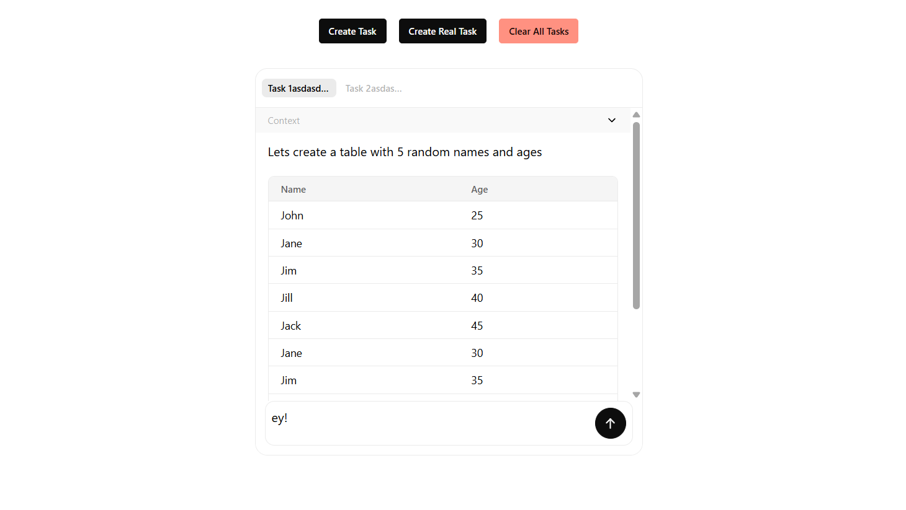

# ngx-agent-taskflow

This project provides an Angular chat component (`ngx-chat-agent`) designed to interact with AI agents, displaying the flow of tasks and messages.

## What is it for?



`@dotted-labs/ngx-chat-agent` is an Angular library that simplifies the creation of interactive chat interfaces with AI agents. It allows you to:

- Display conversations with multiple tasks or threads.
- Visualize different types of messages (user, agent thinking, context, final result, tool messages).
- Manage the state of tasks and messages reactively.
- Customize the appearance and behavior of message components.
- Easily integrate with backend services that communicate with language models (LLMs).
- Support real-time streaming responses via Server-Sent Events (SSE).

## Installation

To install the package in your Angular project, use npm:

```bash
npm install @dotted-labs/ngx-chat-agent
```

Also ensure you have the necessary peer dependencies installed (Angular, RxJS, etc.).

The library uses `ngx-sse-client` for Server-Sent Events integration. It should be installed automatically as a dependency.

## How to use it?

1.  **Import the Component:** Import `ChatAgentComponent` into the module or standalone component where you want to use it.

    ```typescript
    import { ChatAgentComponent } from '@dotted-labs/ngx-chat-agent';

    @Component({
      selector: 'app-my-chat',
      standalone: true,
      imports: [ChatAgentComponent /* ... other imports ... */],
      template: `<ngx-chat-agent [componentMap]="componentMap" />`,
    })
    export class MyChatComponent {
      // ...
    }
    ```

2.  **Initialize the Store:** Inject `TaskListStore` and initialize it. This configures the base behavior and callbacks to interact with your agent logic.

    ```typescript
    import { Component, OnInit, inject } from '@angular/core';
    import { TaskListStore, ComponentMap } from '@dotted-labs/ngx-chat-agent';
    import { AgentService } from './services/agent.service'; // Your service to talk to the AI

    @Component({
      /* ... */
    })
    export class MyChatComponent implements OnInit {
      private readonly taskListStore = inject(TaskListStore);
      private readonly agentService = inject(AgentService); // Your service

      // Optional: Map for custom components (see extension section)
      public readonly componentMap: ComponentMap = {
        /* ... */
      };

      ngOnInit() {
        this.taskListStore.init({
          globalContextPrompt: 'Initial context or prompt for the agent.',
          callbacks: {
            onUserMessage: (taskId: string, message: string) => {
              // Connect the user's response to your AI service
              const agentStream = this.agentService.chat(message, taskId);
              this.taskListStore.chatWithAgent(agentStream, taskId, message);
            },
            // Implement other callbacks as needed (onTaskCreate, onTaskUpdate, etc.)
            onTaskCreate: (task) => console.log('Task created:', task),
          },
        });
      }

      // Logic to create tasks
      async createNewTask() {
        const task = await this.taskListStore.createTask('New task name');
        // Optionally, you can start a conversation immediately
        const agentStream = this.agentService.chat('Initial message', task.id);
        this.taskListStore.chatWithAgent(agentStream, task.id, 'Initial message');
      }
    }
    ```

3.  **Agent Service:** You need to create a service that handles communication with your backend using Server-Sent Events. Here's an example:

    ```typescript
    import { Injectable } from '@angular/core';
    import { SseClient } from 'ngx-sse-client';

    @Injectable({
      providedIn: 'root',
    })
    export class AgentService {
      constructor(private sseClient: SseClient) {}

      public chat(message: string, threadId: string) {
        return this.sseClient.stream(
          `http://your-backend-url/agent/chat?message=${message}&threadId=${threadId}`,
          { keepAlive: true, reconnectionDelay: 100_000, responseType: 'event' },
          { headers: {} },
          'GET',
        );
      }
    }
    ```

    The `chatWithAgent` method expects a stream of SSE events with types like 'message', 'tool', 'error', and 'done'.

## Data Structures

The library primarily works with two main data structures defined in `@dotted-labs/ngx-chat-agent`:

1.  **`Task<TypeEnum, ObservationType>`**: Represents a single conversation or task thread.

    - `id: string`: A unique identifier for the task.
    - `name: string`: The display name for the task (e.g., shown in the tab).
    - `status: TaskStatus`: The current state (`STARTING`, `PROCESSING`, `DONE`, `FAILED`).
    - `allowUserInput: boolean`: Controls if the user input field is active for this task.
    - `messages: TaskMessage<TypeEnum, ObservationType>[]`: An array containing all the message turns within the task.

2.  **`TaskMessage<TypeEnum, ObservationType>`**: Represents a single message turn from a specific sender.

    - `sender: TaskMessageSender`: Indicates who sent the message (`USER`, `ASSISTANT`, or `SYSTEM`).
    - `data: TaskData<TypeEnum, ObservationType>[]`: An array containing the actual content pieces of the message turn.

3.  **`TaskData<TypeEnum, ObservationType>`**: This is the core structure that represents a piece of information in the conversation.
    - `type: TypeEnum | TaskMessageTypes`: Specifies the kind of data. It can be a standard type (`TaskMessageTypes.THINK`, `TaskMessageTypes.CONTEXT`, `TaskMessageTypes.MESSAGE`, `TaskMessageTypes.TOOL`, etc.) or a custom type you define (e.g., `CustomTaskMessageTypes.TOOL_TABLE`).
    - `content: string`: The main content for this data piece. For standard types like `THINK` or `MESSAGE`, this is typically text. For tool messages, it might be a stringified representation or identifier for the tool's action/result.
    - `observation?: ObservationType`: Optional structured data associated with this piece, useful for custom components that need more than just string content.

The `chatWithAgent` method processes SSE events and automatically creates the appropriate message structure based on event types.

## SSE Event Types

The `chatWithAgent` method handles the following event types:

- **message**: Text content from the agent, typically showing the thinking or final response.
- **tool**: Tool usage information, with name and content data.
- **error**: Error messages when something goes wrong.
- **done**: Signals the completion of the agent's response.

## Extension and Customization (Components for Tools)

You can customize how certain types of messages are displayed, especially those generated by tools (`tool_code`, `tool_result`).

1.  **Define Custom Message Types:** Create an enum or constants for your tool-specific message types.

    ```typescript
    // Example: models/custom-message-types.enum.ts
    export enum CustomTaskMessageTypes {
      TOOL_TABLE = 'tool_table',
      TOOL_GRAPH = 'tool_graph',
      // ... other types
    }
    ```

2.  **Create Custom Components:** Develop Angular components that know how to render the data associated with your custom message types. These components will receive the `TaskMessage` as input.

    ```typescript
    // Example: components/message-table/message-table.component.ts
    import { Component, Input } from '@angular/core';
    import { TaskMessage } from '@dotted-labs/ngx-chat-agent';

    @Component({
      selector: 'app-message-table',
      standalone: true,
      template: `
        <div class="message-tool-table">
          <h4>Data Table</h4>
          <!-- Logic to render the table from message.content -->
          <pre>{{ message.content | json }}</pre>
        </div>
      `,
      styles: [
        /* ... */
      ],
    })
    export class MessageTableComponent extends MessageDirective<string, { dataTable: { headers: string[]; rows: string[][] } }> {
      @Input({ required: true }) message!: TaskMessage;
    }
    ```

3.  **Map Types to Components (`ComponentMap`):** In your main component (where you use `<ngx-chat-agent>`), create a `ComponentMap` that associates your custom message types with the components that render them. Pass this map to the `[componentMap]` input of `ngx-chat-agent`.

    ```typescript
    import { ComponentMap } from '@dotted-labs/ngx-chat-agent';
    import { CustomTaskMessageTypes } from './models/custom-message-types.enum';
    import { MessageTableComponent } from './components/message-table/message-table.component';
    import { MessageGraphComponent } from './components/message-graph/message-graph.component'; // Another example component

    @Component({
      /* ... */
    })
    export class MyChatComponent implements OnInit {
      // ...
      public readonly componentMap: ComponentMap = {
        [CustomTaskMessageTypes.TOOL_TABLE]: MessageTableComponent,
        [CustomTaskMessageTypes.TOOL_GRAPH]: MessageGraphComponent,
        // You can override default components if necessary
        // [TaskMessageType.USER]: MyCustomUserMessageComponent,
      };
      // ...
    }
    ```

When `TaskListStore` receives a message whose `type` matches a key in `componentMap`, it will render the associated component instead of the default component for that message type.

## Styling and Customization

The component uses the following libraries for its default styling:

- **Tailwind CSS 4:** For CSS utilities.
- **DaisyUI:** As a Tailwind plugin for predefined UI components.
- **ng-icon / Tabler Icons:** For iconography.

You can fully customize the appearance by overriding Tailwind/DaisyUI styles in your own project or by configuring Tailwind to use your own theme and prefixes if needed, ensuring the chat integrates seamlessly with your application's design.

## Running the Demo

This repository includes a demonstration application within the `projects/demo` directory. This demo serves as a practical example of how to integrate and utilize the `ngx-chat-agent` component.

**Prerequisites:**

- Ensure you have Node.js and npm installed.
- Install project dependencies by running `npm install` in the root directory.

**Launching the Demo:**

To run the demo application, execute the following command from the project's root directory:

```bash
npm run start
```

This command utilizes the Angular CLI (`ng serve`) to build and host the demo application locally. By default, it should be accessible in your web browser at `http://localhost:4200/`.

**What the Demo Shows:**

- **Chat Interface:** You'll see the main `ngx-chat-agent` component rendered, providing a familiar chat UI.
- **Task Management:** The demo allows you to create multiple chat tasks (conversations). Each task appears in a separate tab.
- **Interaction Buttons:**
  - `Create Task`: Starts a new chat task and connects it to an agent service via SSE.
  - `Clear All Tasks`: Removes all current tasks from the interface.
- **Custom Tool Component:** The demo demonstrates how custom data can be rendered within the chat. For example, a message with type `TOOL_TABLE` renders a custom `MessageTableComponent` to display tabular data directly in the chat flow.

Interacting with the demo provides a hands-on understanding of the library's core features, state management via `TaskListStore`, and the customization capabilities using `ComponentMap`.
